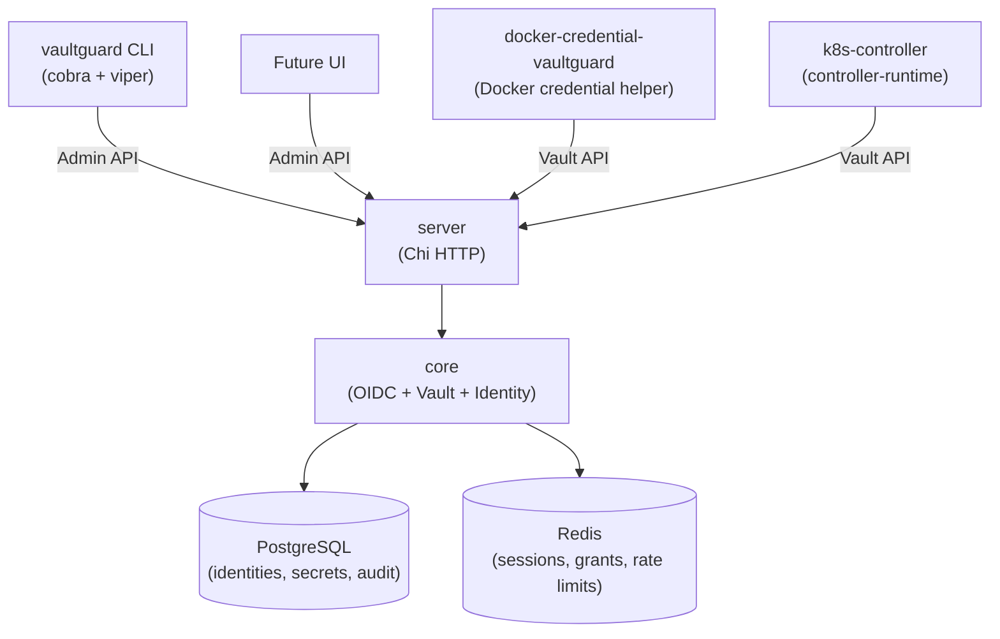

# Vaultguard

A production-grade, open-source identity and secrets management platform for containerised infrastructure.

## Architecture



## Modules

| Module | Description |
|---|---|
| [`core`](core/README.md) | Domain library — OIDC engine, Vault, Identity, DB |
| [`server`](server/README.md) | HTTP server binary (OIDC + Vault + Admin API) |
| [`cli`](cli/README.md) | `vaultguard` operator CLI |
| [`docker-plugin`](docker-plugin/README.md) | `docker-credential-vaultguard` credential helper |
| [`k8s-controller`](k8s-controller/README.md) | Kubernetes controller + mutating webhook |

## Quick Start

```bash
# 1. Generate a root key
export VAULTGUARD_ROOT_KEY=$(openssl rand -base64 32)

# 2. Start backing services + server
docker compose -f deploy/docker-compose.yml up

# 3. Login
vaultguard login

# 4. Write a secret
vaultguard secret put ci/docker/registry-creds username=robot password=s3cr3t

# 5. Read it back
vaultguard secret get ci/docker/registry-creds
```

## Building

```bash
make build          # compile all binaries → bin/
make test           # unit tests
make test-integration  # integration tests (requires Docker)
make generate       # sqlc + controller-gen
make docker-build   # Docker images
make helm-package   # Helm chart
```

## Security Notes

- Passwords hashed with Argon2id (64 MB, 3 iterations, parallelism 2).
- All secrets encrypted with AES-256-GCM envelope encryption; root key never stored on disk.
- Audit log is append-only, enforced by Postgres triggers.
- Access tokens default to 15-minute TTL; refresh tokens stored as SHA-256 hashes.

## Implementation Status

- [x] Step 1 — `core/db`: migrations, sqlc queries, connection pool
- [x] Step 1 — `core/identity`: user + client + policy services
- [x] Step 1 — `core/vault`: crypto, store, lease manager
- [x] Step 1 — `core/oidc`: JWT issuance, PKCE, provider, key rotation
- [x] Step 2 — `server`: HTTP handlers, TLS, rate limiting, Prometheus metrics
- [x] Step 3 — `cli`: operator commands (login, secrets, clients, policies, admin)
- [x] Step 4 — `docker-plugin`: `docker-credential-vaultguard` credential helper
- [ ] Step 5 — `k8s-controller`: CRD + controller + mutating webhook
- [ ] Step 6 — `deploy/helm`: production Helm chart

See [ROADMAP.md](ROADMAP.md) for the full project agenda.
